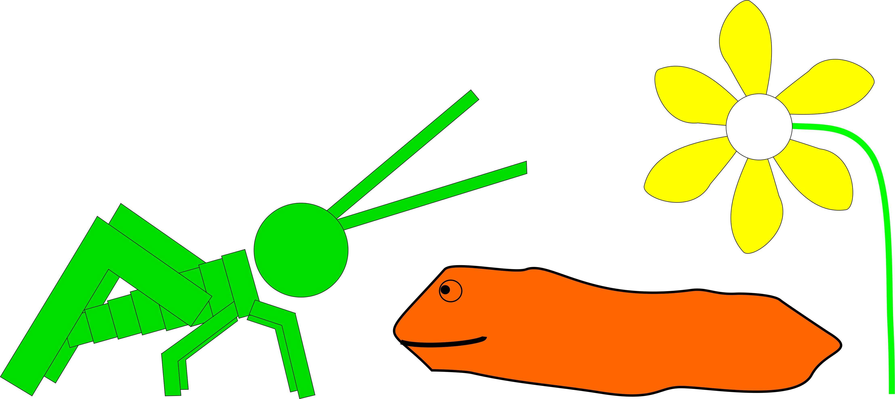

  

# smart-agriculture-datasets

## About

The repository hosts our datasets related to smart agriculture domains.

## Contents
- [Computer vision](#computer-vision-)
- [Time series](#time-series-)

## Computer vision

- [Arion rufus snails dataset](https://github.com/firefly-cpp/snail-dataset)

## Time series

- [Monitoring plant parameters with ESP32](https://github.com/firefly-cpp/smart-agriculture-datasets/tree/main/plant-monitoring-esp32)
- [Monitoring plant parameters with Raspberry PI](https://github.com/firefly-cpp/smart-agriculture-datasets/tree/main/plant-monitoring-rpi)

## License
Shield: [![CC BY-SA 4.0][cc-by-sa-shield]][cc-by-sa]

Material in this folder is licensed under a
[Creative Commons Attribution-ShareAlike 4.0 International License][cc-by-sa].

[![CC BY-SA 4.0][cc-by-sa-image]][cc-by-sa]

[cc-by-sa]: http://creativecommons.org/licenses/by-sa/4.0/
[cc-by-sa-image]: https://licensebuttons.net/l/by-sa/4.0/88x31.png
[cc-by-sa-shield]: https://img.shields.io/badge/License-CC%20BY--SA%204.0-lightgrey.svg
